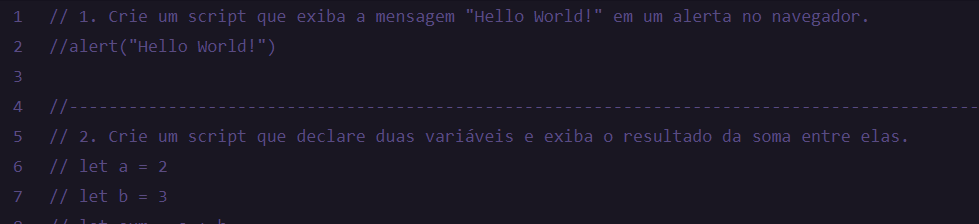

<h1 align="center"> Desafio Intensivão 02 </h1>

Projeto realizado no curso Explorer da [Rocketseat](https://www.rocketseat.com.br) com o objetivo de estudar manipulação dados em JavaScript.

  

## 🚀 Tecnologias

Esse projeto foi desenvolvido com as seguintes tecnologias:

- JavaScript
